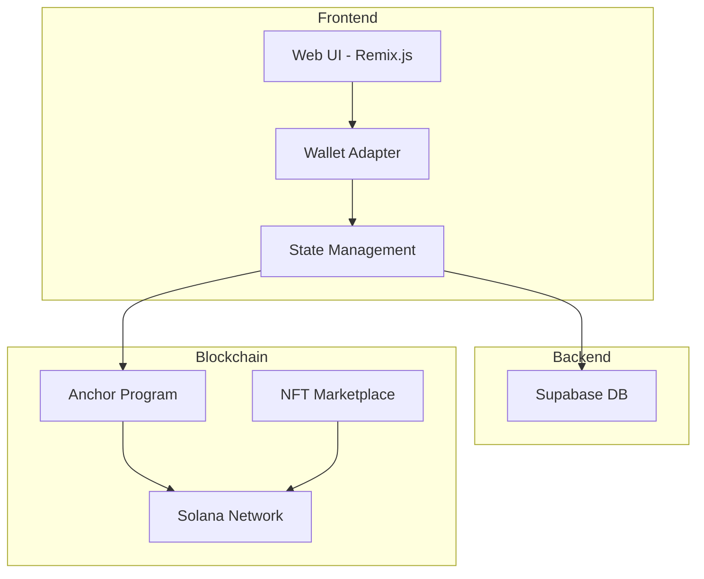
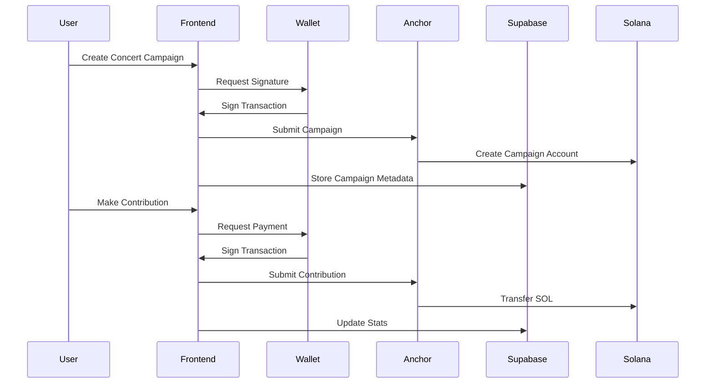
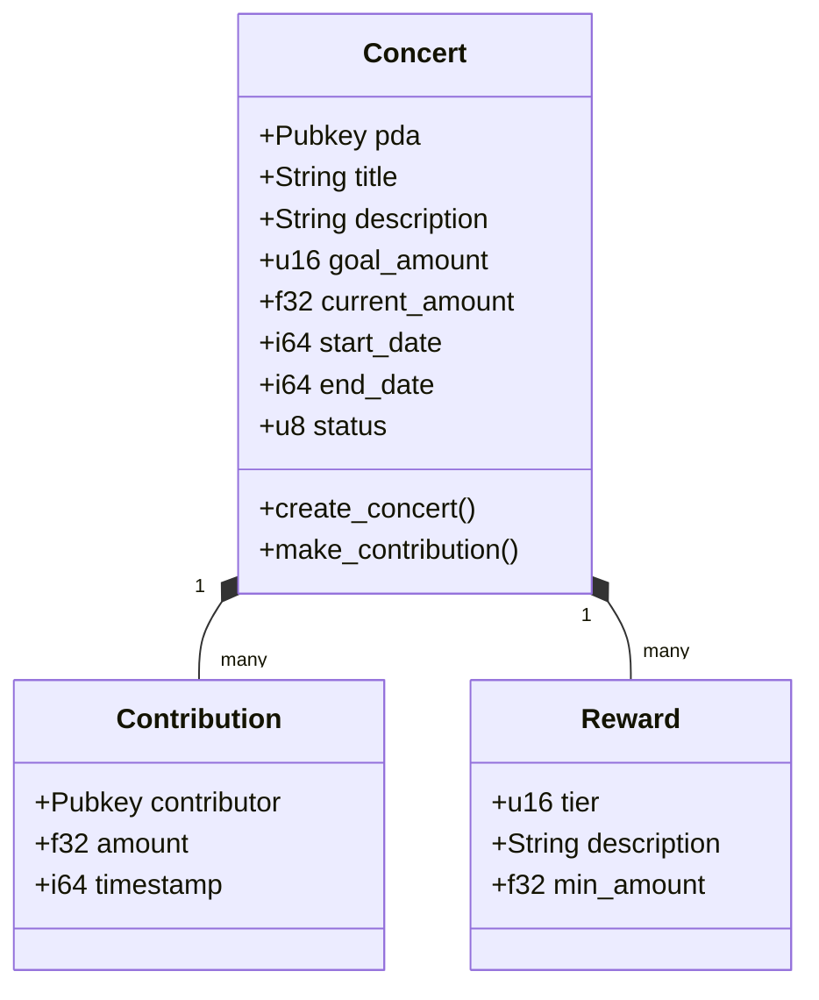
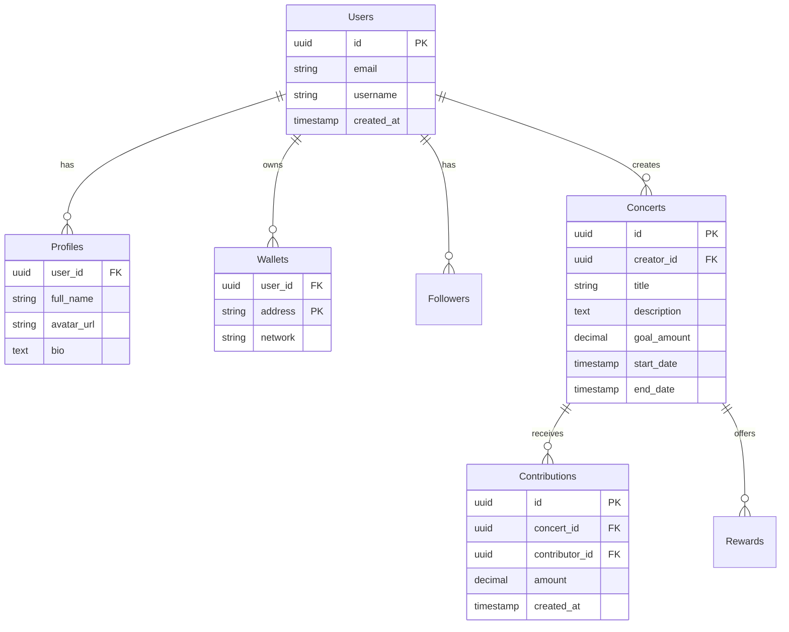

# Architecture Overview

ConcertX is a decentralized crowdfunding platform for music artists built on Solana blockchain. This document provides an overview of the system architecture.

## System Components

## Data Flow

## User Flow

```mermaid
graph LR
    A[Artist] -->|Creates Campaign| B[Set Campaign Details]
    B --> C[Set Funding Goal]
    C --> D[Set Rewards]
    D --> E[Launch Campaign]

    F[Backer] -->|Views Campaign| G[Select Reward Tier]
    G --> H[Connect Wallet]
    H --> I[Make Contribution]
    I --> J[Receive NFT]

    E -.->|Available for| F
```

## Smart Contract Architecture

## Database Schema

## Technology Stack

- **Frontend**
  - Remix.js (React Framework)
  - TailwindCSS (Styling)
  - Solana Wallet Adapter
  - Framer Motion (Animations)

- **Backend**
  - Anchor (Solana Smart Contracts)
  - Rust (Smart Contract Language)
  - Supabase (Database & Auth)

- **Blockchain**
  - Solana (Layer 1)
  - Metaplex (NFT Standard)

## Security Considerations

1. **Smart Contract Security**
   - Input validation
   - Access control
   - Secure fund handling
   - Rate limiting

2. **Frontend Security**
   - Wallet connection security
   - Transaction signing
   - Data validation

3. **Database Security**
   - Row Level Security (RLS)
   - API key management
   - Data encryption 